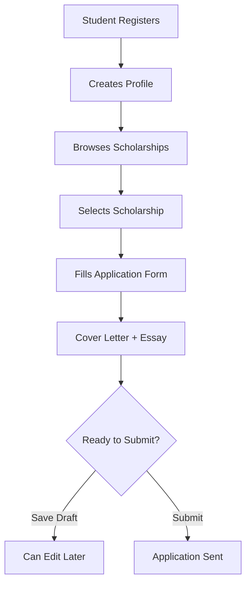
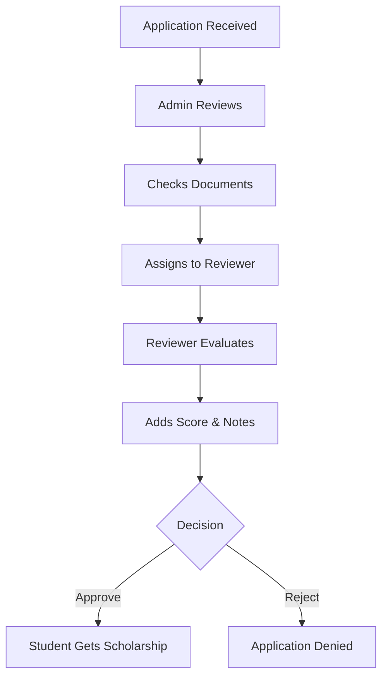
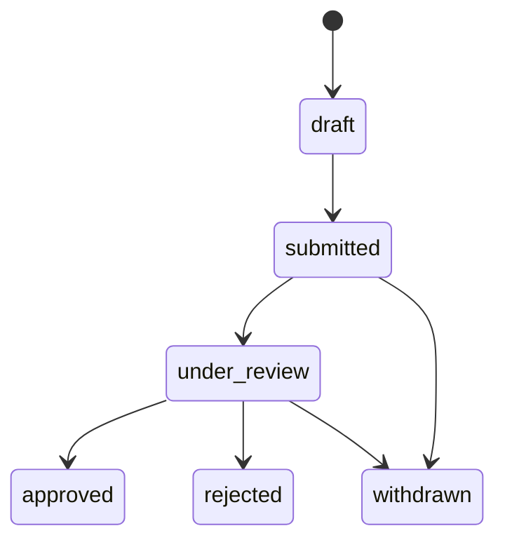

# ScholarTrack - Scholarship Management System Demo

## 📋 What is ScholarTrack?

ScholarTrack is a web application that helps manage scholarship applications from start to finish. It connects students who need scholarships with organizations that provide them.

### 🎯 Key Features

- **Easy Application Process**: Students can apply for scholarships online
- **Application Tracking**: See the status of your applications in real-time
- **Admin Management**: Review and approve applications efficiently
- **Multiple User Roles**: Different access levels for different users

---

## 👥 Who Uses the System?

| Role                    | What They Do                                     |
| ----------------------- | ------------------------------------------------ |
| **Students/Applicants** | Apply for scholarships, track their applications |
| **Admins**              | Review applications, manage the system           |
| **Staff/Reviewers**     | Help process and evaluate applications           |

---

## 🔄 How the Application Process Works

### Step 1: Student Applies



### Step 2: Admin Reviews



---

## 🖥️ Demo: How to Use the System

### For Students (Applicants)

1. **Sign Up**
    - Visit the website and create an account
    - You'll automatically get "applicant" access

2. **Complete Your Profile**
    - Add your personal information (name, contact details)
    - Include academic details (GPA, field of study)
    - This helps with your applications

3. **Find Scholarships**
    - Browse available scholarships
    - Click on ones that interest you
    - Check if you meet the requirements

4. **Apply**
    - Click "Apply" on a scholarship
    - Write a cover letter (why you deserve it)
    - Write an essay about your goals
    - Save as draft or submit immediately

5. **Track Your Applications**
    - Go to "Applications" in your menu
    - See all your submitted applications
    - Check status updates

### For Administrators

1. **Login as Admin**
    - Use admin credentials to log in

2. **Review Applications**
    - Go to Admin → Applications
    - See all applications from all students
    - Use filters to find specific applications

3. **Manage Applications**
    - Click on any application to view details
    - Review student information and essays
    - Assign applications to reviewers
    - Update status (approved/rejected)
    - Add scores and notes

4. **Use Filters**
    - Filter by status (submitted, under review, approved)
    - Filter by scholarship type
    - Search by student name
    - Find applications assigned to specific reviewers

---

## 📊 Application Status Flow



**Status Meanings:**

- **Draft**: Application saved but not submitted yet
- **Submitted**: Student sent the application
- **Under Review**: Being evaluated by admins
- **Approved**: Student gets the scholarship
- **Rejected**: Application was denied
- **Withdrawn**: Student cancelled the application

---

## 🚀 Quick Start Demo

### Setup the System

```bash
# Install the application
composer install
npm install

# Setup database
php artisan migrate
php artisan db:seed

# Start the server
php artisan serve
```

### Demo Accounts

**Administrator Accounts:**

- **Admin**: `admin@scholartrack.local` / `password`
- **Staff**: `staff@scholartrack.local` / `password`
- **Municipality**: `municipality@scholartrack.local` / `password`
- **PESO Officer**: `peso@scholartrack.local` / `password`

**Applicant Accounts:**

- **John Doe**: `applicant@scholartrack.local` / `password`
- **Jane Smith**: `jane.smith@example.com` / `password`
- **Maria Garcia**: `maria.garcia@example.com` / `password`
- **Carlos Rodriguez**: `carlos.rodriguez@example.com` / `password`
- **Sarah Johnson**: `sarah.johnson@example.com` / `password`

### Try It Out

1. Login as student and create an application
2. Login as admin and review the application
3. Change the status and add notes
4. See how the student can track the changes

---

## 🎯 Why Use ScholarTrack?

### For Students

- **Easy to Apply**: Simple online forms
- **Track Progress**: Know exactly where your application stands
- **Save Drafts**: Work on applications over time

### For Administrators

- **Organized Process**: All applications in one place
- **Team Collaboration**: Assign reviewers to help
- **Quick Filtering**: Find applications fast
- **Detailed Tracking**: Full history of decisions

### For Organizations

- **Fair Process**: Structured evaluation system
- **Scalable**: Handle many applications at once
- **Professional**: Clean, easy-to-use interface

---

_This is a simple guide to get you started with ScholarTrack. The system handles the complete scholarship application workflow from submission to approval._
